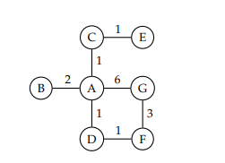

# searchAlgorithms
This is an implementaion of breadth-first search (BFS), depth-first seach (DFS) and uniform-cost search (UCS) using python.

### Example
The following graph has been used to test the algorithms.You can implement any other graph as desired.

### Guide
- Instanciate `Graph` class and using `add_vertex()` and `add_edge()` methods you can construct your tree.
- Search tree from starting node to destination node by calling one of BFS, DFS or UCS fucntions from search module.
The output should look like this:
`Path: B->A->D->F->G `
